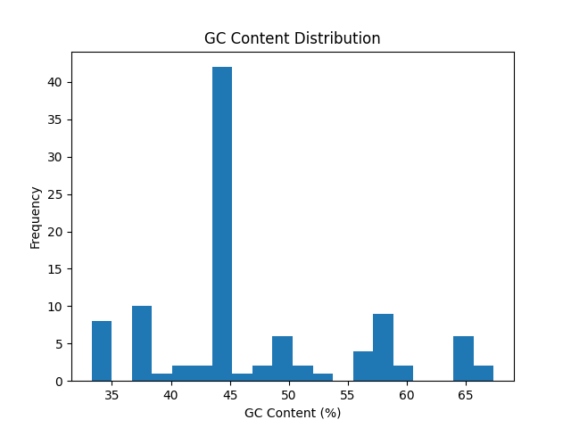
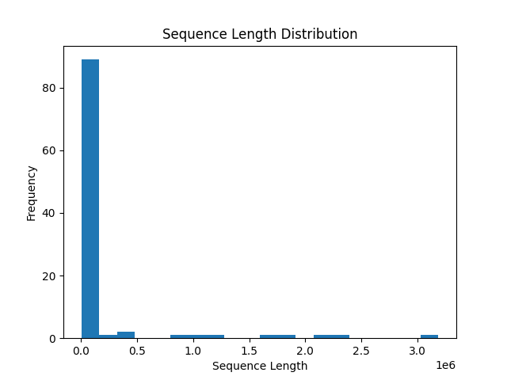

# Analysis Report: Human Mitochondrial DNA

## 1. Introduction

Mitochondrial DNA (mtDNA) is a small, circular genome found in mitochondria and inherited maternally. It plays a key role in energy production and is widely used in genetic, evolutionary, and forensic studies.  

This project analyzes **100 human mtDNA sequences** retrieved from the NCBI Nucleotide database, focusing on two characteristics:

1. **GC content** – proportion of guanine (G) and cytosine (C) nucleotides  
2. **Sequence length** – total number of nucleotides in each sequence  

The goal is to demonstrate a bioinformatics workflow: data retrieval, processing, analysis, and visualization.

---

## 2. Methods

### 2.1 Data Retrieval
Sequences were retrieved programmatically from **NCBI Nucleotide database** using the **Entrez E-utilities API**.  
- Query: `"human mitochondrial DNA AND Homo sapiens"`  
- Format: FASTA  
- Number of sequences: 100  

### 2.2 Data Processing
- Remove FASTA headers  
- Calculate **sequence length**  
- Calculate **GC content** using the formula:  

\[
\text{GC content (\%)} = \frac{\text{count(G) + count(C)}}{\text{sequence length}} \times 100
\]

Processed data saved to `data.csv`.

### 2.3 Analysis
Two main analyses:  
1. GC content distribution  
2. Sequence length distribution  

### 2.4 Visualization
- **Figure 1:** Histogram of GC content (`figure1.png`)  
- **Figure 2:** Histogram of sequence length (`figure2.png`)  

Optional bonus: interactive scatter plot (`interactive_plot.html`) of GC content vs sequence length.

---

## 3. Results

### 3.1 GC Content

Most sequences have **44–46% GC content**, consistent with literature. Few outliers are present, showing that mitochondrial GC content is relatively conserved.

**Figure 1: GC Content Distribution**  

---

### 3.2 Sequence Length

Sequence lengths vary slightly due to partial sequences in the database. Most sequences are ~800 bp, as expected.

**Figure 2: Sequence Length Distribution**  

---

### 3.3 GC vs Sequence Length (Interactive)

The scatter plot (interactive, `interactive_plot.html`) shows sequences cluster around similar GC percentages. This visualization highlights sequences that deviate in length or composition.

---

## 4. Discussion

- **GC content** consistency confirms mtDNA conservation across individuals.  
- **Length variations** reflect sequencing fragments, not biological differences.  
- Visualizations help detect outliers and trends in sequence composition.  

**Potential Improvements:**  
- Analyze functional motifs or regions  
- Include multiple species for comparative analysis  
- Incorporate SNP or variant analysis  

---

## 5. Conclusion

This project demonstrates a full bioinformatics workflow:

1. Retrieve real biological sequences via an API  
2. Process and calculate sequence features  
3. Visualize distributions and relationships  

Python scripting and visualization tools (matplotlib, Plotly) enable **efficient and reproducible genomic analyses**.

---

## 6. AI Use Disclosure

**AI tool used:** ChatGPT  

**What I used it for:** Structuring the report, suggesting figures and workflow explanations, and writing descriptions of methods and results.  

**How I verified output:** All scripts were tested to ensure correct sequence retrieval, GC content calculation, sequence length calculation, and figure generation. Outputs were manually reviewed for accuracy.

---

## 7. Author

Fardowsa Mohamud
